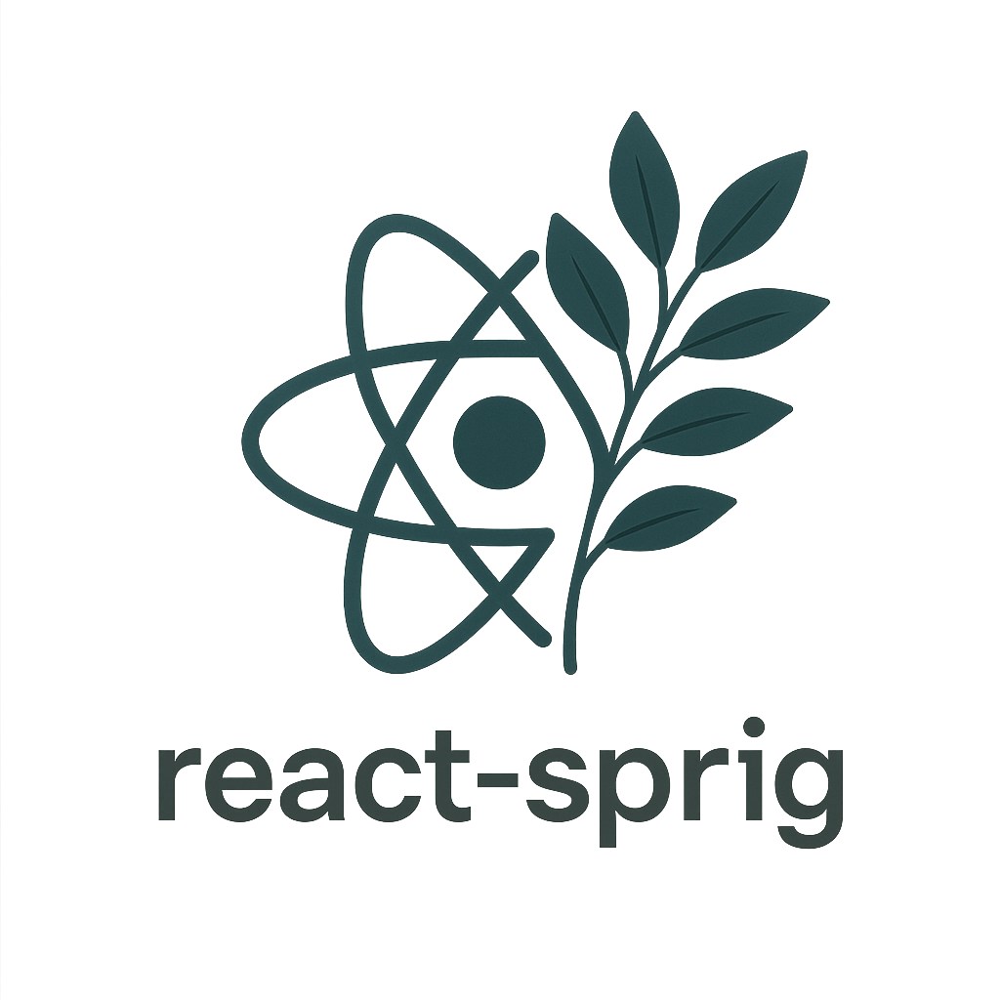

<p align="center">
  
</p>

[](https://badge.fury.io/js/@wesleywardlaw%2Freact-sprig)

# react-sprig

react-sprig is a UI component library developed in React and Tailwind that provides all of the basic components needed to kickstart a project. A Storybook demonstrating the components is available at [https://react-sprig.netlify.app/](https://react-sprig.netlify.app/).

## Getting Started

To install dependencies:

```
pnpm install
```

To run the project in development mode:

```
pnpm run storybook
```

## Testing

This project uses [Vitest](https://vitest.dev/) for unit and component tests. To run the tests, use:

```
pnpm test
```

or

```
pnpm run test
```

For interactive test UI:

```
pnpm run test:ui
```

## Playwright Tests

Additional tests are written with [Playwright](https://playwright.dev/). To run Playwright tests, use:

```
pnpm run test:playwright
```

## Publishing with Verdaccio

To test publishing locally, you can use [Verdaccio](https://verdaccio.org/docs/installation/). There is a script to publish to a local Verdaccio registry:

```
pnpm run verdaccio
```

This allows for the import and use of react-sprig components in other apps. When running verdaccio, you can then run this command to install react-sprig from your local registry:

```
pnpm install react-sprig --registry http://localhost:4873
```

See the [Verdaccio documentation](https://verdaccio.org/docs/installation/) for setup and usage instructions.
